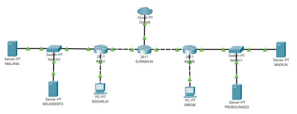
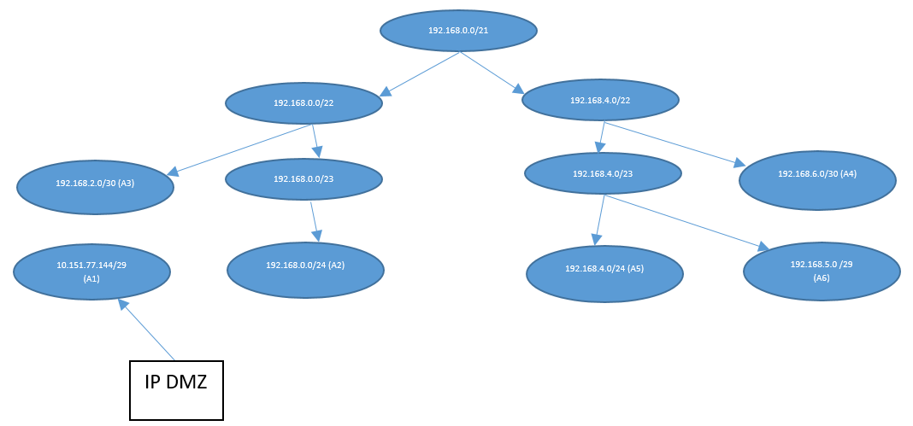
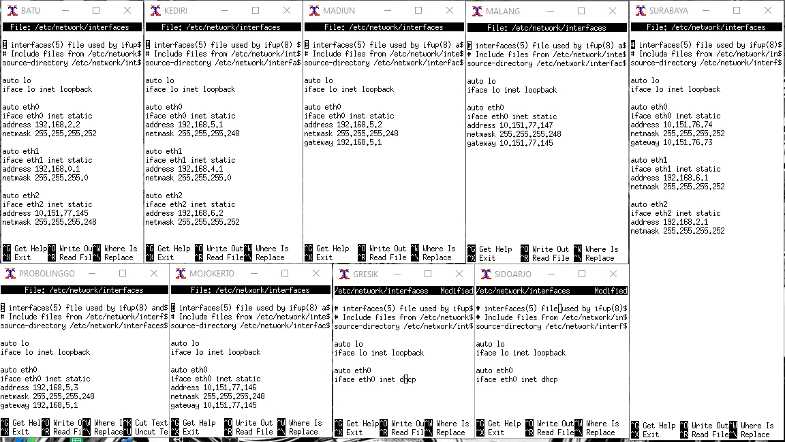
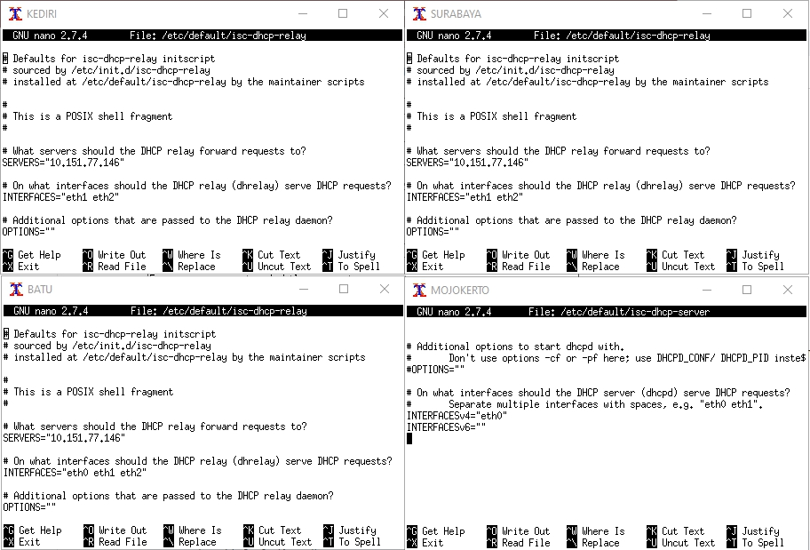

# Lapres Jarkom - Modul 5 - T12
## Oleh
- Mohammad Ifaizul Hasan – 05311840000029
- Anggada Putra Nagamas – 05311840000025

## Teknis Pengerjaan
1. Perhatikan penempatan konfigurasi IPTABLES yang telah ditentukan pada soal. Apabila tidak ditetapkan di soal, maka diperbolehkan mengatur IPTABLES dimana saja.

## Soal
Setelah kalian mempelajari semua modul yang telah diberikan, Bibah ingin meminta bantuan untuk
terakhir kalinya kepada kalian. Dan kalian dengan senang hati mau membantu Bibah.
(A) Tugas pertama kalian yaitu membuat topologi jaringan sesuai dengan rancangan yang diberikan
Bibah seperti dibawah ini :



**Keterangan :**
SURABAYA diberikan IP TUNTAP
MALANG merupakan DNS Server diberikan IP DMZ
MOJOKERTO merupakan DHCP Server diberikan IP DMZ
MADIUN dan PROBOLINGGO merupakan WEB Server
Setiap Server diberikan memory sebesar 128M
Client dan Router diberikan memori sebesar 96M
Jumlah host pada subnet SIDOARJO 200 Host
Jumlah host pada subnet GRESIK 210 Host

(B) karena kalian telah mempelajari Subnetting dan Routing, Bibah meminta kalian untuk membuat
topologi tersebut menggunakan teknik CIDR atau VLSM. Setelah melakukan subnetting, (C) kalian
juga diharuskan melakukan routing agar setiap perangkat pada jaringan tersebut dapat terhubung.
(D) Tugas berikutnya adalah memberikan ip pada subnet SIDOARJO dan GRESIK secara dinamis
menggunakan bantuan DHCP SERVER (Selain subnet tersebut menggunakan ip static). Kemudian
kalian mengingat bahwa kalian harus setting DHCP RELAY pada router yang menghubungkannya,
seperti yang kalian telah pelajari di masa lalu.

(1) Agar topologi yang kalian buat dapat mengakses keluar, kalian diminta untuk mengkonfigurasi
SURABAYA menggunakan iptables, namun Bibah tidak ingin kalian menggunakan
MASQUERADE.

(2) Kalian diminta untuk mendrop semua akses SSH dari luar Topologi (UML) Kalian pada server
yang memiliki ip DMZ (DHCP dan DNS SERVER) pada SURABAYA demi menjaga keamanan.

(3) Karena tim kalian maksimal terdiri dari 3 orang, Bibah meminta kalian untuk membatasi DHCP
dan DNS server hanya boleh menerima maksimal 3 koneksi ICMP secara bersamaan yang berasal dari
mana saja menggunakan iptables pada masing masing server, selebihnya akan di DROP.

Kemudian kalian diminta untuk membatasi akses ke MALANG yang berasal dari SUBNET
SIDOARJO dan SUBNET GRESIK dengan peraturan sebagai berikut:
● (4) Akses dari subnet SIDOARJO hanya diperbolehkan pada pukul 07.00 - 17.00 pada hari Senin
sampai Jumat.
● (5) Akses dari subnet GRESIK hanya diperbolehkan pada pukul 17.00 hingga pukul 07.00 setiap
harinya. Selain itu paket akan di REJECT. 

Karena kita memiliki 2 buah WEB Server, (6) Bibah ingin SURABAYA disetting sehingga setiap
request dari client yang mengakses DNS Server akan didistribusikan secara bergantian pada
PROBOLINGGO port 80 dan MADIUN port 80.

(7) Bibah ingin agar semua paket didrop oleh firewall (dalam topologi) tercatat dalam log pada setiap
UML yang memiliki aturan drop.
Bibah berterima kasih kepada kalian karena telah mau membantunya. Bibah juga mengingatkan agar
semua aturan iptables harus disimpan pada sistem atau paling tidak kalian menyediakan script sebagai
backup.

## Jawaban
Soal Shift Modul 5 dikerjakan dengan menggunakan teknik CIDR (Classless Inter Domain Routing)

**Soal (A)**
- Buat file `topologi.sh` dengan isi seperti gambar berikut:


**Soal (B)**
- CIDR (Classless Inter Domain Routing)

**Langkah 1**
- Buat pembagian subnet dan hitung subnet pada tiap bagian seperti gambar berikut ini:


**Cara Pembuatan :**
- Gabungkan Host A1 - A2 & A5 - A6 hingga membentuk Host baru yaitu B1 & B2 dengan Subnet Mask /23. 
- Kemudian gabungkan Host B1 - A3 & B2 - A4 hingga membentuk Host baru yaitu C1 & C2 dengan Subnet Mask /22.
- Terakhir gabungkan Host C1 - C2 hingga membentuk Host baru yaitu D1  dengan Subnet Mask /21.

**Langkah 2**
- Hitung IP Address yang dibutuhkan (Jumlah Host, Router, dan Server). Pada soal ini ada kurang lebih 422 IP Address maka subnet yang dipakai untuk membuat pohon IP yaitu subnet 21. 

| Nama | Jumlah IP | Netmask |
|--|--|--|
| A1 | 3 | /29 |
| A2 | 201 | /24 |
| A3 | 2 | /30 |
| A4 | 2 | /30 |
| A5 | 211 | /22 |
| A6 | 3 | /29 |

- Buat pohon IP berdasarkan pembagian subnet yang ada pada topologi seperti gambar berikut ini:



**Soal (C)**
- Routing dilakukan dengan mengisi file `/etc/network/interfaces` terlebih dahulu seperti gambar berikut:




- Kemudian isi file route.sh pada uml SURABAYA, KEDIRI, dan BATU seperti gambar berikut:


**Soal (D)**
- Tugas berikutnya adalah memberikan ip pada subnet SIDOARJO dan GRESIK secara dinamis menggunakan bantuan DHCP SERVER (Selain subnet tersebut menggunakan ip static). Kemudian kalian mengingat bahwa kalian harus setting DHCP RELAY pada router yang menghubungkannya, seperti yang kalian telah pelajari di masa lalu.

- Pertama isi file `/etc/dhcp/dhcpd.conf` pada UML MOJOKERTO seperti gambar berikut:


- Kemudian isi file `/etc/default/isc-dhcp-relay` pada UML SURABAYA, KEDIRI, BATU, dan MOJOKERTO seperti gambar berikut:




**Soal (1)**
- Agar topologi yang kalian buat dapat mengakses keluar, kalian diminta untuk mengkonfigurasi SURABAYA menggunakan iptables, namun Bibah tidak ingin kalian menggunakan MASQUERADE.
- Konfigurasi UML SURABAYA dengan syntax berikut:

`iptables -t nat -A POSTROUTING -s 192.168.0.0/16 -o eth0 -j SNAT --to-source 10.151.76.73` 


**Soal (2)**
- Kalian diminta untuk mendrop semua akses SSH dari luar Topologi (UML) Kalian pada server yang memiliki ip DMZ (DHCP dan DNS SERVER) pada SURABAYA demi menjaga keamanan.
- Konfigurasi UML SURABAYA dengan syntax berikut:

`iptables -A FORWARD -d 10.151.77.144/29 -s 10.151.76.73 -p tcp --dport 22 -j DROP`


**Soal (3)**
- Karena tim kalian maksimal terdiri dari 3 orang, Bibah meminta kalian untuk membatasi DHCP dan DNS server hanya boleh menerima maksimal 3 koneksi ICMP secara bersamaan yang berasal dari mana saja menggunakan iptables pada masing masing server, selebihnya akan di DROP.
- Konfigurasi UML MALANG & MOJOKERTO dengan syntax berikut:

`iptables -A INPUT -m connlimit --connlimit-above 3 --connlimit-mask 0 -j DROP`


**Soal (4)**
- Akses dari subnet SIDOARJO hanya diperbolehkan pada pukul 07.00 - 17.00 pada hari Senin sampai Jumat.
- Atur IPTABLES RULE pada UML SIDOARJO dengan syntax berikut:


```
  iptables -A INPUT -s 192.168.0.0/24 -m time --timestart 00:00 --timestop 06:59 --weekdays Mon,Tue,Wed,Thu,Fri -j REJECT
  iptables -A INPUT -s 192.168.0.0/24 -m time --timestart 17:01 --timestop 23:59 --weekdays Mon,Tue,Wed,Thu,Fri -j REJECT
  iptables -A INPUT -s 192.168.0.0/24 -m time --weekdays Sat,Sun -j REJECT
```


**Soal (5)**
- Akses dari subnet GRESIK hanya diperbolehkan pada pukul 17.00 hingga pukul 07.00 setiap harinya.
- Atur IPTABLES RULE pada UML GRESIK dengan syntax berikut:

`iptables -A INPUT -s 192.168.1.0/24 -m time --timestart 07:01 --timestop 16:59 -j REJECT`

**Soal (6)**
- Bibah ingin SURABAYA disetting sehingga setiap request dari client yang mengakses DNS Server akan didistribusikan secara bergantian pada PROBOLINGGO port 80 dan MADIUN port 80.
- Konfigurasi UML SURABAYA dengan menambahkan syntax berikut:
```
iptables -A PREROUTING -t nat -d 10.151.77.144 -p tcp --dport 80 -m statistic --mode nth --every 2 --packet 0 -j DNAT --to-destination 192.168.5.3:80
iptables -A PREROUTING -t nat -d 10.151.77.144 -p tcp --dport 80 -j DNAT --to-destination 192.168.5.2:80
```

- Konfigurasi UML PROBOLINGGO dengan menambahkan syntax berikut:
`iptables -t nat -A POSTROUTING -p tcp -d 192.168.5.3 --dport 80 -j SNAT --to-source 10.151.77.144:80`

- Konfigurasi UML MADIUN dengan menambahkan syntax berikut:
`iptables -t nat -A POSTROUTING -p tcp -d 192.168.5.2 --dport 80 -j SNAT --to-source 10.151.77.144:80`

**Soal (7)**
- Bibah ingin agar semua paket didrop oleh firewall (dalam topologi) tercatat dalam log pada setiap UML yang memiliki aturan drop.
- Pada SURABAYA tambahkan perintah iptables sebagai berikut:
```
iptables -N LOGGING
iptables -A FORWARD -j LOGGING
iptables -A LOGGING -m limit --limit 2/min -j LOG --log-prefix "IP Tables Packet Dropped: " --log-level 4 
iptables -A LOGGING -j DROP
```

-Pada MALANG dan MOJOKERTO tambahkan perintah iptables sebagai berikut:
```
iptables -N LOGGING
iptables -A INPUT -j LOGGING
iptables -A OUTPUT -j LOGGING
iptables -A LOGGING -j LOG --log-prefix "IP Tables Packet Dropped: " --log-level 4
iptables -A LOGGING -j DROP
```
